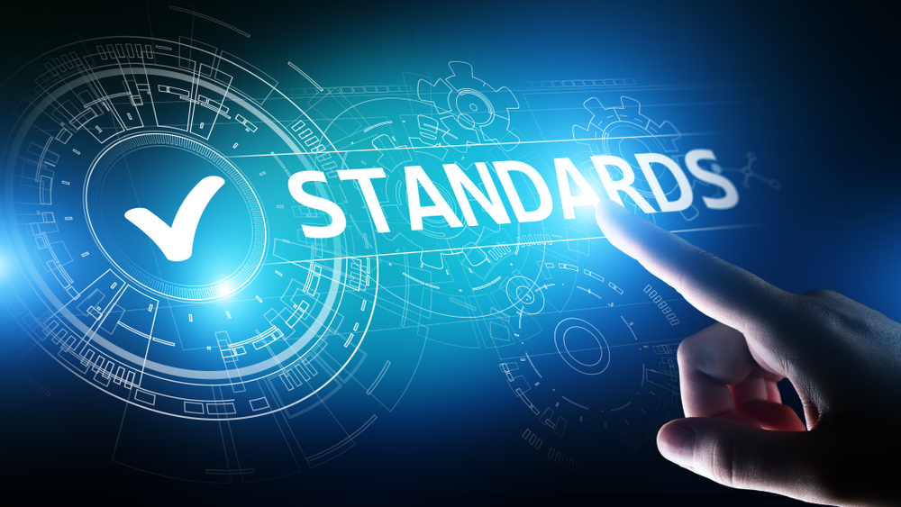

Although a minor bonus reason, I majored in Computer Science to avoid abundant writing. To be clear, I do not despise writing but prefer my academic focus to not revolve around it. Learning rules like how to use prepositional phrases, what the purpose of semicolons are, and the difference between single and double quotation marks feels tedious. Now here we are with coding standards once again learning to choose between single and double quotes. Why are coding standards important and are they needed? My opinion on the matter is a close reflection of my opinion on English writing.

## Importance of Rules

When writing, constructing sentences in different ways can give off different tones and change how easy they are to comprehend. Although reading code cannot necessarily impart a tone to the reader, it can communicate the professionalism of the coder. Much like in technical writing, this impacts the reader’s impression of the coder as well as their willingness to trust this code. Moreover, one of the main purposes of applying coding standards is to improve the readability of code. While this may not be as important for private projects, many coding projects are made accessible to the public through open-source platforms or posting portions of code to forums. Ensuring one’s code meets coding standards makes it easier for others to comprehend it for the purposes of contributing, referring to, and utilizing.

## Tedious Rules

Having to consistently follow grammar rules can be burdensome; however, writing with grammar rules in mind makes them much less tedious. If the paper is written with them in mind, then rereading and revising is a smaller hassle. On the other hand, if one is told to revise a random paper written without these rules in mind, then it becomes tiring and can even lead to errors because the many revisions may not flow well together. Programming with coding standards is the same way. As long as the code is written with the rules in mind, there is much less to fix at the end. But when given code not following any coding standards—like an assignment I completed recently about fixing code to meet the coding standards—it becomes tedious and irritating. In some cases, the code may stop working as intended due to the many changes that were made.

## Concluding Thoughts

Let us go back to an earlier question. Are coding standards needed? Yes! They may be tedious, but they are needed for facilitating an efficient and professional environment especially when it comes to collaboration. Therefore, I will continue to learn and apply them for my projects no matter the software language. 