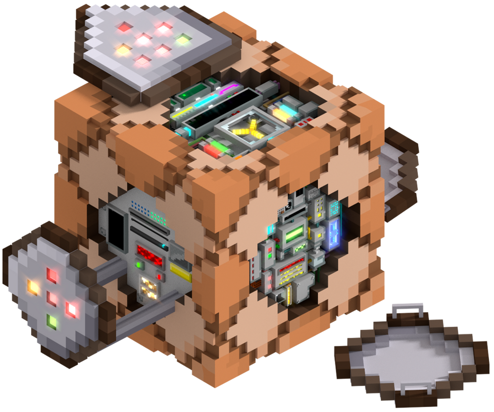

## The Beginning: Minecraft

Where did my interest in software engineering begin? I could be more professional and say a game development course I took during the lockdown or the free online introduction to computer science course provided by Harvard. However, my interest started with Minecraft. One random day, I discovered this item called a command block, which can run in-game commands—essentially establishing Minecraft’s very own programming language. The moment I discovered them, I started teaching myself how they worked through simple trial and error with no outside resources. I found every available command by typing one letter into the game’s chat bar and seeing what commands popped up starting with that letter. I then experimented with each command to learn what they did. I started coding my own mini games and at one point started creating a Minecraft version of Among Us. I would spend hours coding without realizing how much time had passed. This is when I realized that my passion was programming.

## My Computer Science Journey

With this epiphany, I desired to learn more. I wanted to learn actual coding, which is when I started taking courses like the ones I previously mentioned in preparation for college. My journey as a computer scientist began with gaining a fundamental understanding of C, Python, HTML, CSS, SQL, and JavaScript. I was taught each of their applications and gained some experience in using them in conjunction with each other. I built websites, developed terminal-based games, made a simple hash table for a searching algorithm, etc. Then, after my first year of college, I participated in an internship where I learned to code sensors and produce files with pre-generated code. Most of the software was new to me which tested my abilities to adapt, conduct research, and work efficiently. Once my sophomore year began, I joined a coding competition with four other individuals to produce a website improving the management and viewing of projects and reports for different users. I experienced collaborating with a team to produce a product in a short period of time. This led to discovering how to plan a tech stack, dealing with merge conflicts, and working on different branches on a GitHub repository. Now in my current courses, I am learning TypeScript as well as how to design and analyze algorithms.

## Looking to the Future

Yet the more I know, the smaller my pool of knowledge feels. There are still numerous unknowns for me. I want to experience building apps and how to code with more advanced algorithmic approaches like backtracking, breath-first search, and depth-first search. I want to develop my own large language models and artificial intelligence. Furthermore, one of my greatest interests is quantum computing. The idea of how bits can exist as both a zero and one simultaneously to vastly increase computational power fascinates me. I want to have firsthand experience with it. Of course, I need to expand my knowledge in Physics greatly and improve my coding skills. But no matter how far out of reach it feels, I will continue taking one step forward to accomplish this goal. Ultimately, I want to learn as much as I can about what computer science has to offer—and will offer in the future—while having meaningful experiences in each topic.
