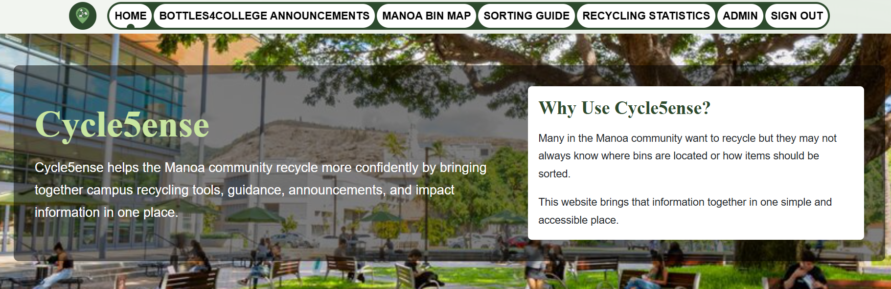

  

 

Cycle5ense is a website designed to encourage good recycling practices in the UH Manoa campus. It includes an interactable map displaying each of the recycle bin locations on campus, information about what can and can not be recycled, campus statistics on how much has been recycled, as well as announcements about Bottles4College (a nonprofit organization collecting recyclables to fund college scholarships). Users can also create an account to input how much they have recycled and see their own impact via their profile page.

For this project, I did not have any particular focus area (that is the front-end, back-end, etc.). Instead, I supported my team by ensuring all requirements were being met by the timeframe as well as fixing any bugs that may have occurred after multiple commits. Every few weeks, we received a new set of requirements of what was expected of our website. When I saw an unmet condition, I took responsibility of implementing it. For instance, I regularly updated the home page with the most current information, implemented all of the playwright tests, and deploying the project to Vercel. As for fixing random bugs, we would have issues such as incorrectly listing users on the admin page, inconsistent background color, complications with the navbar display, and problems with certain pages not displaying correctly for certain browsers. Moreover, there were many times where commits would cause problems with Vercel deployment. Since I setup Vercel for our project, I was the only one that could see the build logs and errors. Therefore, I would find where the issue was occurring based on this information and fix it.

I enjoyed working on this project because it helped me improve many skills related to working with a team to achieve one overall goal. I learned systems that allowed us to all consistently work on the same code and make progress on our project while minimizing conflicts. Additionally, I developed stronger communication skills since I consistently updated my teammates with the current status of the website and the most important tasks to prioritize. Overall, I became a more capable software engineer.

The website can be viewed <a href="https://cycle5ense.vercel.app/"><i class="large github icon "></i>here</a>

GitHub Organization: <a href="https://github.com/cycle5ense"><i class="large github icon "></i>https://github.com/cycle5ense</a>
