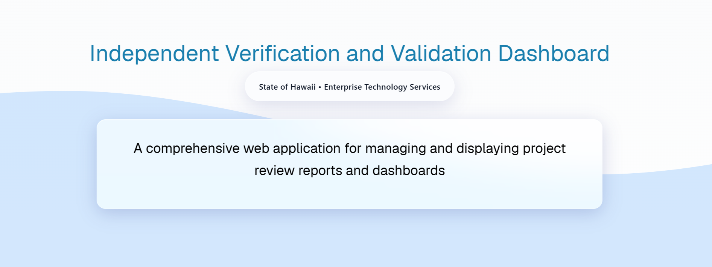

  

The Honolulu Annual Code Challenge (HACC) is a coding competition ranging from amateurs up to professional programmers where they develop solutions for real problems within the community of Hawaii. The competition I participated in lasted one month. The project my team selected was to develop a web application that standardized how projects and their respective reports were viewed or edited by Enterprise Technology Services (ETS) employees, Independent Verification and Validation (IV&V) vendors, and the public.

Within the first week, our team decided on the tech stack, made flowcharts, and produced mock web pages in Figma. These steps aided in facilitating an efficient development process for the following weeks. We then divided into back-end and front-end teams where I focused on front-end development. While waiting for the ability to pull actual data from the database, I developed some of the pages planned in Figma along with their components. I ensured that they were responsive and worked as expected. Additionally, I established a user-friendly navigation bar. Once the database was set up, each page and their components were converted to use data from the database. In the days preceding the project submission, our team continually tested and fixed bugs in the webpage.

Although the competition only lasted a month, it was highly educational and I gained valuable experience. Firstly, it was the first computer science-related and competitive group project I participated in. A few of my team members were a lot more experienced than me, so I learned about steps to take when approaching a coding project such as setting up a tech stack and creating different GitHub branches to work on to avoid merge conflicts. Moreover, we had to be in consistent communication since each member was working independently. There was very little time for group meetings, and those times were generally dedicated to understanding what our current progress was and what steps need to be taken next. Secondly, I was exposed to new software, specifically the framework React. I had to quickly learn how React worked as well as the syntax and logic behind TypeScript. Additionally, I had to figure out how to integrate the pages I built with real-time information from our database.

The website with sample data can be viewed <a href="https://cachemoney-46cb3.web.app/"><i class="large github icon "></i>here</a>

Source Code: <a href="https://github.com/HACC25/Cache-Money"><i class="large github icon "></i>https://github.com/HACC25/Cache-Money</a>
