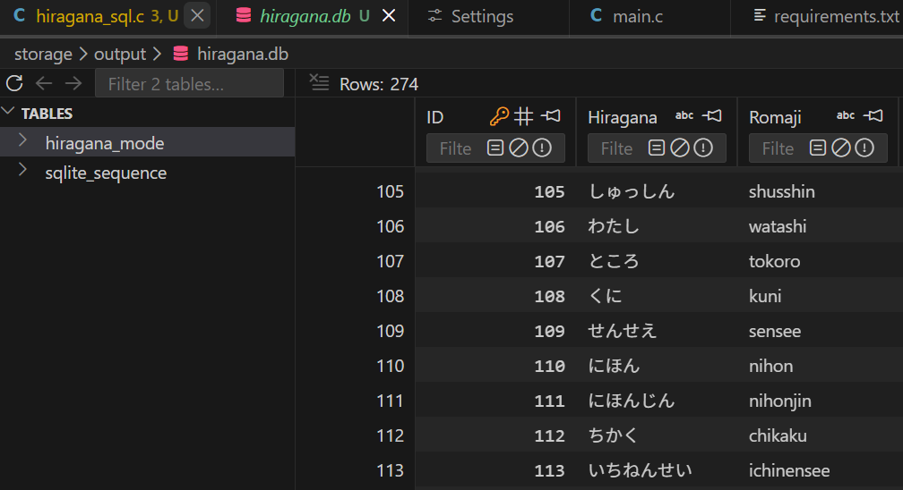

  

The Japanese Reading Game is a text-based game designed to aid in improving the reading comprehension speed of Japanese hiragana and katakana characters. The logic of the game is to provide words written in hiragana or katakana to a user and then have that individual respond with the romaji version of the word. The faster a user answers, the more points they gain. The hiragana and katakana words along with their romaji counterpart are stored in a SQLite database. The game itself is written in C and interfaces with SQLite to provide questions to the user and check the user’s answers. Currently, the game can only be played using the terminal. I plan to make it more accessible to users through Discord.

I am creating a Python coded Discord bot that acts as the intermediary between the user and the game. Although I have not solved all of the issues yet, it has been an engaging challenge to interact between three different languages at the same time. This project has been improving my existing technical skills while developing new ones.

Source Code: <a href="https://github.com/danilk09/Japanese-Reading-Game"><i class="large github icon "></i>https://github.com/danilk09/Japanese-Reading-Game</a>
